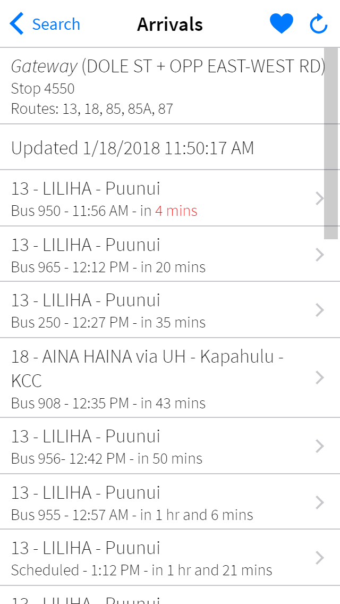

  
  

When I started this project in December of 2015, the City & County of Honolulu had a published mobile application in both the Apple App Store and the Google Play Store, named DaBus. This was the "official" native mobile app for tracking busses. After having used the app for a while, I found some "quirks" with the app that I felt needed fixing. For example, if you didn't know the numerical ID of a stop, and wanted to find it on the app using its name (using the names of the streets that the stop is on), it did not work well at all. The best way to find a stop was to type the first few letters of the street it was on. This was bad, especially if that street has many stops along the way. Take the stop on South King St and Punchbowl St for example. In order to find this stop without using location services, one would have to search for "king" and scroll through the 100+ stop results to find it. Typing "S KING ST + PUNCHBOWL ST" (the actual name of the stop) yielded no results. Also, while DaBus allowed users to add favorite stops, it did not allow users to give those stops nicknames. Lastly, the iOS version of the app was developed targeting iOS 6, so the visual theme was the old and outdated skeumorphic design. These reasons, among a few others, inspired me to create my own transit tracking app that included these improvements and features.

Since then, the City & County of Honolulu has published a second app, called "DaBus2", that updated the theme to match iOS 7 - 9, and added the ability to give nicknames to stops. However, the main issue for me - the search function - has not improved.

I am the sole developer of this project. I am responsible for creating all of the icons used, the back-end server, and the front-end client design. The back-end is built in JavaScript using Node.js. The front-end is dynamically generated using an object-oriented approach, using instances of "view" classes. I wanted to avoid using jQuery, so this front-end is powered by a simple framework that I created, called CommonLib. Client-server communication is accomplished by utilizing websockets, implemented using socket.io. This application uses the public OTS TransitMaster API and OTS-provided GTFS (General Transit Feed Specification) data to present realtime vehicle tracking and arrival data.

You can check out a public deployment of the project at <a href="https://thebusapp.herokuapp.com/">https://thebusapp.herokuapp.com/</a>.
