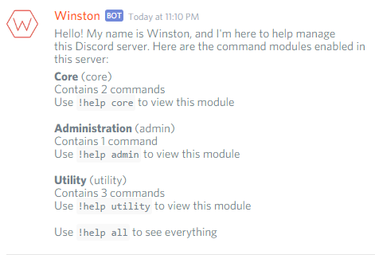
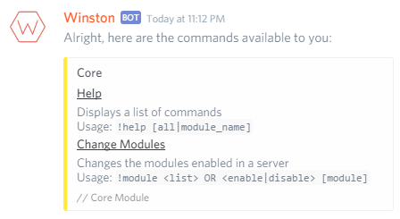

  
  

Winston is a Discord bot written in JavaScript and utilizing the discord.js library. I started developing this bot as a replacement for another Discord bot that I wrote that utilized the discord.io library. However, I had been wanted to re-write the bot for a while now, and just recently, discord.io has been deprecated until it supports the newest Discord gateway version, v6. As such, the old Discord bot does not function correctly. This change has forced me to start writing this new bot.

This bot is being written in modern JavaScript, making full use of ECMAScript 6 class constructs, Promises, and the let and const keywords. Modularity was the key concept in this bot, so commands have been separated in to separate command "modules" that can be enabled/disabled on a per-server basis.
